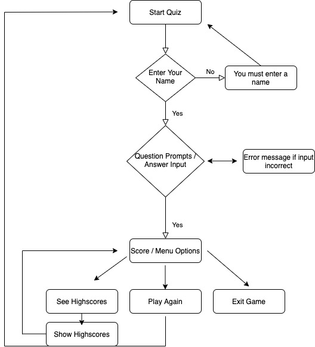

Link to my GIT for Assignment > https://github.com/dwbra/Terminal_App

## Software Development Plan

### 1. Describe at a high level what the application will do

My application will be a quiz game to test players bro-level. This is a satire game quiz built for players to have a laugh and answer a 
set of questions based on made up scenarios. The application will take in users input such as their name, answers to questions, and menu selections
and then return to players their score, highscores of other players, and a basic menu to exit the game if they wish. 

### 2. Identify the problem it will solve and explain why you are developing it

The problem it will solve is boredom. As a quiz game, the function of this application is to make players laugh and be entertained for a short period of time. 
The reason that I chose to develop this was purely out of personal satisfaction. I found the idea of a Bros Quiz hilarious and because I found it funny it really
kept me engaged throughout the project. At the start of the course our instructors said to build what you enjoyed and so keeping that in mind I sought to develop
something that I myself would find entertaining. 

### 3. Identify the target audience

The target audience for this game would primarily be males aged between 18-40 years old. The nature of this satire is based on pop-cultre and 
Austrailan slang references. Although some female users may find some of the questions funny, as a male I've just written jokes about what I know and 
find funny being a 28 year old male.

### 4. Explain how a member of the target audience will use it

A member of the target audience will launch the game in their terminal shell from running the install-run.sh file in the root directory. Once that is triggered, the game will start and present the player with an introduction to the game and set of instructions how to proceed. Once the player enters their name, they will be presented with a range of 10 questions from which they can answer either A, B, or C. Once the quiz is completed, they will be shown their score along with a custom message depending on how well they preformed. After that they will be presented with a menu of options to see highscores, play again, or exit the game.

## Features List
### Develop a list of features that will be included in the application. It must include:
### - at least THREE features
### - describe each feature

My MVP features list is succinct 
- As a user, I want to be able to be shown quiz questions and answer them
- As a user, I want to be able to see my score upon completion of the game
- As a user, I want to be able to see the highscores 
- As a user, I need to be able to play the game again
- As a user, I need to be able to exit the game

The first feature is the quiz method itself. This quiz method will operate as a loop with a conditional control structure put in place to ensure that user input is valid against the answer options. This method will use a for loop to iterate through a questions array and then check against a Questions class for the answer. 

The second feature involves keeping track of a users score. In the quiz method, the score variable will be set to 0. Upon each correct iteration where the question.answer equals the users input, their score will be incremented by 1. A user will have to answer ten questions therefore 10/10 will be the highest possible score. The use of shorthand operaters here will be essential in meeting the brief to keep DRY code.

The third feature is the highscores method. To keep a range of user highscores, once a player reaches over a score of 8+ their name will be pushed into a special array. This array will then be written into a .txt file in the root directory of the application. This .txt file will store all of the highscore player names and then be able to be called upon to read and present the highscores to users upon the request. 

The forth feature will be a method to trigger users to be able to play again. This will be an independent method that gets called in a menu of options. This independent menu method will present users with a range of choices. To either see the highscores, which would trigger the highscores method, to play the game again which would trigger a seperate method, or a simple exit with an output message. 

## Diagram Flowchart
### Develop a diagram which describes the control flow of your application.

## Implementation Plan
### Develop an implementation plan which:
### - outlines how each feature will be implemented and a checklist of tasks for each feature
### - prioritise the implementation of different features, or checklist items within a feature
### - provide a deadline, duration or other time indicator for each feature or checklist/checklist-item

### Utilise a suitable project management platform to track this implementation plan

### > Your checklists for each feature should have at least 5 items.

Feature Implementation #1 - The Quiz
The Quiz is the main method of the program. I will create a Questions Class to store the users name, questions and answers. The attributes will have to be able to be accessed outside of the class and will be labeled with the correct permissions. The checklist for this method is the below.
- Have a class that initializes at least two objects, prompts and answers. 
- Have a class that has correct attr persmissions 
- Have an array of questions stored in the program
- Create a range of instance objects to pass the questions from the array into
- Write the questions for the quiz

Feature Implmentation #2 - The Answer & Score Validation
It is imperative for the success of the application that the answers are compared correctly against the user input. It is also crucial that once this input has been deemed correct user input, that depending on their answer if correct their overall score is increased. 
- Have a for loop to iterate through the questions
- Have a variable for score
- Have a variable for answer
- Have a validation test for the answer
- Use conditional operators to dislay different messages based on the users score

Feature Implementation #3 - The Highscore & End Menu 
Once a user completes the game, it is important to show the user a range of options to select from. The best way to do this will be using a case loop. The incorporation of the highscore and conditional operaters will play a key role in pushing the top user scores across into the global variable and eventually into the .txt file. The menu will then contain a series of smaller methods, 1. that will read the highscores.txt file and puts it to the screen for the user and then redisplays the menu options, 2. that will replay the game from the start and 3. that will exit the termainal application.
- Create a global variable to store the user highscore in
- Push the user highscore into the highscore.txt file 
- Create the highscores display method
- Crete the play again method
- Create a case loop to run through the menu options method. 

## Software Docs
### Design help documentation which includes a set of instructions which accurately describe how to use and install the application.

I've created a terminal script called install-run.sh. 
The user just needs to cd into the assignment directory and then run this file from their terminal.
This file will firstly install bundler on the users local machine. Then it will run bundle install and download all of the necessary gems required to run the application. Finally it will launch the program brosquiz.rb as the last command.

Hard Steps to install the application would be:
1. Install Ruby on your machine
2. Install Bundler Gem
3. Run Bundler Install to get all of the gems associated with the application

Dependencies include:

- Ruby 

To install and run 
- `$ gem install bundler` 
- `$ bundle install`
- `$ ruby index.rb`

gem `$ gem install colorize`
gem `$ gem install artii`
gem `$ gem install tty-prompt'
gem `$ gem install rspec`

You can run this from either PC, Mac or Linux systems. 